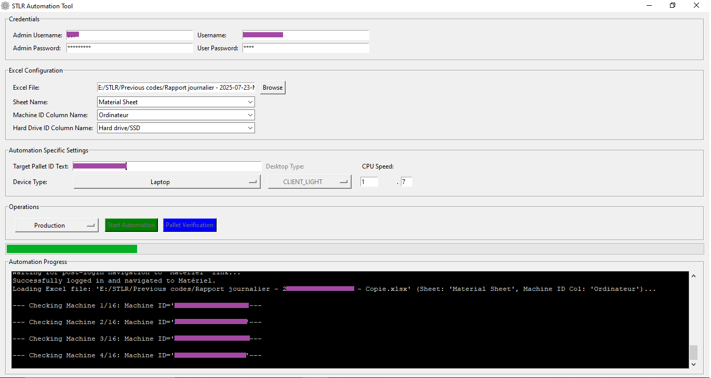
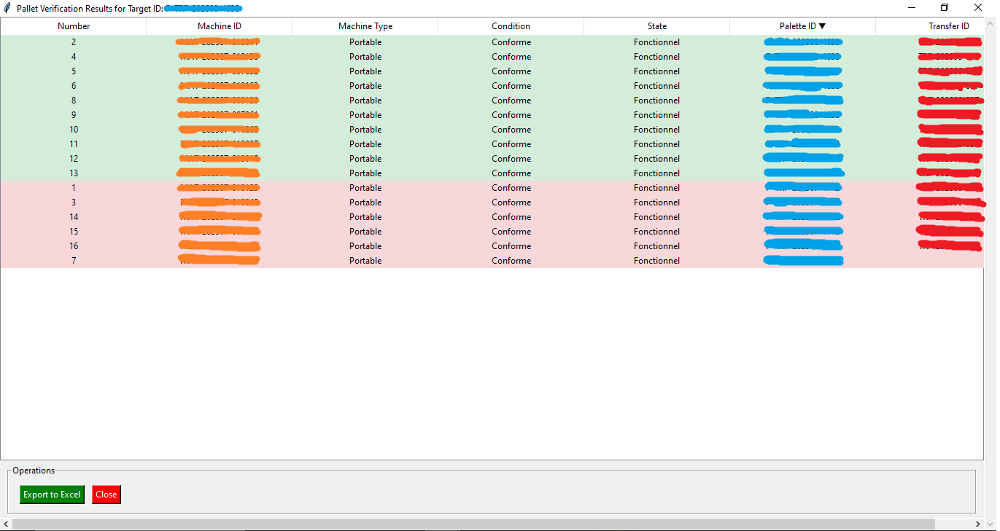
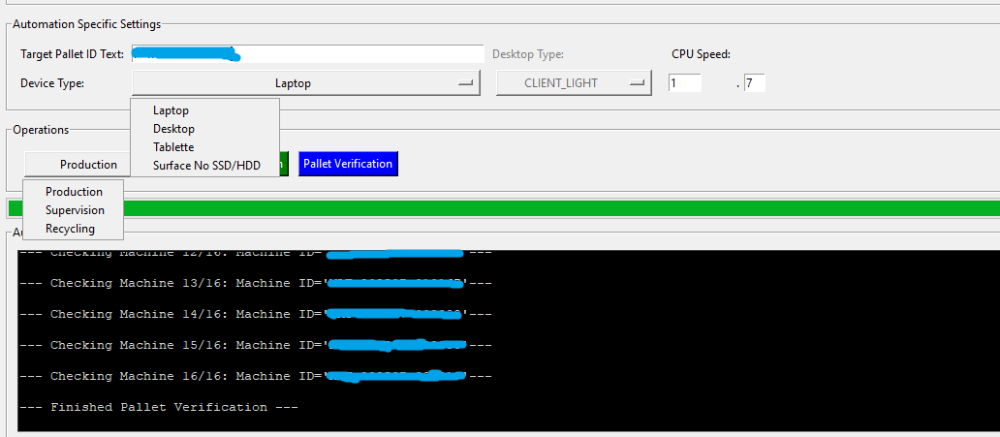
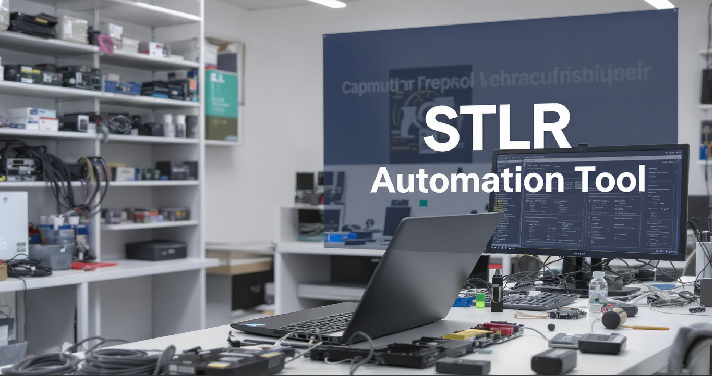

### STLR Production Automation Tool

This repository provides a conceptual overview and demonstration of a tool I developed for STLR in Gatineau, Quebec, Canada, to automate a critical production workflow. The source code is not publicly available to protect intellectual property and operational security.

---

### Project Summary

I identified a significant inefficiency in STLR's production process: the manual assignment of refurbished machines to their respective pallets within the company's Inventory Management System. This was a time-consuming, repetitive, and error-prone task that hindered our team's productivity.

To solve this, I designed and built an internal automation tool. This application connects directly to the web portal, reads machine and hard drive data from an Excel file, and automates the entire process of configuring and assigning devices to the correct production pallets.

The tool has been successfully implemented and is now used daily by multiple teams, including **Production**, **Quality Check**, **Packaging**, and **Recycling**. By automating this core task, it has freed up employees to focus on value-added activities like physical assembly and quality control.

---

### Features 🚀

The tool's key functions include:

* **Automated Web Interaction**: Navigates the company's Inventory Management System to configure and assign machines.
* **Data Processing**: Reads and processes machine and hard drive data directly from a user-provided Excel file.
* **Workflow Automation**: Configures machine specifications (e.g., CPU, device type) and assigns them to the correct pallet.
* **Pallet Verification**: Includes a feature for users to quickly verify the contents of a pallet before shipping.
* **Intuitive User Interface**: A simple GUI allows employees to easily select files and initiate the automation process.

---

### Screenshots 📸

Here are some screenshots showcasing the tool's interface and functionality:

* **Main application window**: 
* **Pallet verification results**: 
* **Different options to choose from**: 
* **App launching**:  

---

### Technologies Used 💻

This project was built with a modern and versatile tech stack:

* **Python**: The core language for the application.
* **Selenium**: For browser automation, enabling interaction with the web portal.
* **Pandas**: For efficient data handling, reading, and processing of Excel spreadsheets.
* **Tkinter**: For creating a functional and user-friendly graphical interface.
* **Threading**: To run the automation in the background, keeping the UI responsive.

---

### Future Vision 🔮

This project has highlighted the potential for further digital transformation. I'm currently exploring future enhancements, including:

* **Integrated Dashboard**: A real-time dashboard to track user performance and display key production metrics.
* **Production Analytics**: Visualizations to show the most produced models by quantity over time.
* **Predictive Forecasting**: Using machine learning models to forecast future production needs based on historical data. This will help STLR anticipate new orders and plan for production schedule more effectively.

